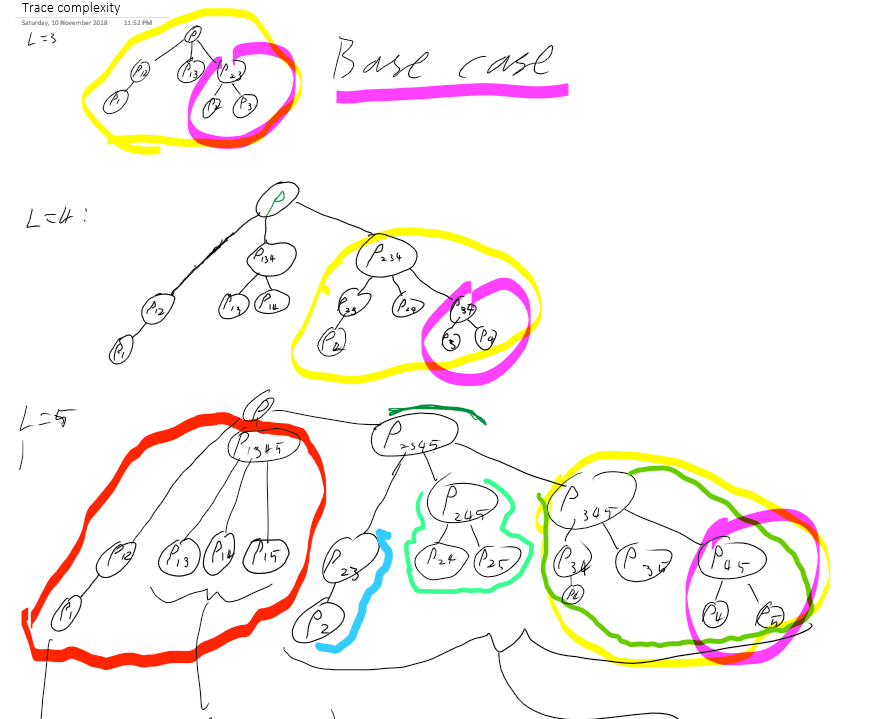

# The partial trace

The *partial trace* is a central aspect of multilinear algebra with widespread physical applications. The intrinsic structure of the trace capture essential properties of quantum systems. Namely, tracing *out* partition of a multipartite state (density operator) produced the *reduced* density operator of the state of the remaining partition. This is the expectation value of the state in the remaining partition. The aim of this project is to understand the partial trace and its computation by implementing it in several ways, with the aim of finding the most effficient algorithmic implementation.

Todo: Probability perspective

## Preliminaries

Define two Hilbert spaces $F$ and $G$, with associated Banach spaces (of bounded Hermitian linear operators) $\mathcal{B}(F)$ and $\mathcal{B}(G)$. Define the tensor product of $F$ and $G$ by the map
$$
\otimes: F, G \to  F \otimes G =: H
$$

Which is linear in both arguments (other properties?). If $F$ and $G$ have dimension $d_F$ and $d_G$, then H has dimension $d_F\times d_G$. If $|f\rangle$ and $|g\rangle$ are orthnormal bases for $F$ and $G$ then the set of vectors $|f\rangle\otimes|g\rangle := |fg\rangle$ are an orthonormal basis for $H$.

The partial trace can then be written as a map
$$
Tr_F (O): F\otimes G \to G
$$

The density matrices of states in $F,G$ and $H$ are positive Hermitian operators with unit trace. The density matrices of $H$ can be seen as elements of $\mathbb{C}^{d_F d_G \times d_F d_G}$, leading to the definition of the partial trace of an operator $O$ as a partial inner product:


$$
Tr_F (O) = Tr_f O_{ij,kl} |f_i g_j\rangle\langle f_k g_l|
$$

$$
Tr_F (O) =  O_{ij,kl} \langle f_i | f_k \rangle\otimes |g_j\rangle\langle g_l|
$$

$$
Tr_F (O) =  O_{ij,kl} \delta_{ik}  |g_j\rangle\langle g_l|
$$

$$
Tr_F (O) =  O_{ij,il}  |g_j\rangle\langle g_l|
$$

Where $Tr_F (O)$ is an operator on $G$. The trace over $F$ is similar. The double-subscript on the matrix $H$ refers to the basis vector of $\mathcal{B}(H)$ formed by the product of the two corresponding basis vectors in $\mathcal{B}(F)$ and $\mathcal{B}(G)$.  

This notation suggests another alternative: Viewing operators as $(d_F \times d_F) \times (d_G \times d_G)$ tensors.


Which leads to the construction of the partial trace as an inner product of non-square matrices

$$
Tr_F(\rho) = \rho'^\dagger \rho'
$$
Where $\rho'$ is a $\frac{d_H}{d_G} \times d_G$ matrix, whose columns are indexed by the basis vectors of G and whose rows are indexed by the basis vectors spanning the space that will be traced out (this needs to be demystified in terms of conditional probabilities...)

Therefore to compute the partial trace of a bipartite system whose elements have dimension $d_F$ and $d_G$, use the algorithm:

```
rho_reshaped = reshape(rho,[d_H*d_H/d_G, d_G])
rho_G  = rho_reshaped'*rho_reshaped   % Note the conjugate transpose
```
Note: MATLAB reshapes by filling columns top-down, left-right, and Python reshapes by filling rows left-right, top-down. Therefore, the outputs would be transposes of one another, and the algorithm implemented accordingly. The above code is a MATLAB example.

Now, a subtlety: To use this method to retrieve the reduced state of $F$, it is a mistake to simply reshape as above with the dimensions interchanged: Indeed, for the case of two qubits, the result would be the same - $\rho_G!$.

The reason lies in the Hadamard-product structure of the basis for $H$. The reshaped density matrix must have the same indexing convention (col idx = basis vector to keep, col idx = vectors to trace out), and so the matrix rows and columns must be permuted to reflect this. In other words, one *can* use the prescription above for finding $\rho_F$, providing one swaps the positions of $F$ and $G!$

To see how, notice that the reshaping (defined above) breaks the operator into 'slices' of length $d_G$ - precisely the 'lowest-level' composition of the product basis, in the sense of the Hadamard product. Permuting the order of $F$ and $G$ is necessary so the reshaping procedure creates columns of `rho_reshaped` in 1-to-1 correspondence with distinguishable outcomes from measuring $F$.

One can simultaneously extend this to generality:

```
rho_factored = reshape(rho, (d_1,d_2,...d_N))
rho_permuted = permute(rho_factored(keep,traceout))
rho_reshaped = reshape(rho_permuted(dim_to_trace,dim_to_keep))
rho_reduced  = rho_reshaped'*rho_reshaped
```
## Conditional probabilities

QM is a theory of probabilities, though, so this discussion would be incomplete without the definition of the partial trace as an expectation value:
$$
Tr_F(O) = \sum_f p(g|f)p(f) O_g
$$


The first construction of the partial trace leads to the algorithm defined by J Maziero, and the second to the vectorized version implemented by T Cubitt. The Xanadu method, making use of `np.einsum()`, is a variation on the latter.

## Recursive algorithm

For a microscopic analysis of quantum many-body states, or for diagnostics of quantum circuit simulations, it is desirable to retrieve the one-body density matrices of the components of a many-body system. Indeed, the few-body reduced matrices may also be of interest, but for simplicity the algorithm below retrieves only the OBDMs. This method is easily extended to compute expectation values of operators, including two-body correlation functions. A generalization to multipartite correlation functions is possible but I'll leave that for now. Extension to CV systems would be extremely cool.

### Depth-one recursion

An implementation of the algorithm to depth-one illustrates the principle to be extended. All calls to partial_trace are evaluated using a fixed algorithm (Currently the reshape-permute-dot product method)
First, initialize working variables from the inputs:
```
Inputs:
  rho   % A density matrix of an L-body system
  dims  % An L-long array specifying subsystem dimensions
        % Assuming all identical dims for now...
Outputs:
  dm_out % A ragged array with OBDMs on the diagonal and 2BDMS on the upper diagonal

L = length(dims)
ent_list = zeros(L,1);
A = zeros(L,L);
A_temp = zeros(L,L);
dm_out = array(L,L) % Of appropriate type for ragged array (MATLAB cell, Python dictionary)
                    % Or just set the first quadrant of the diagonals to the OBDMs
```

The algorithm achieves a speedup by exploiting the exponential complexity of the partial trace. By performing an 'expensive' partial trace over the largest system (hereafter I assume uniform dimensions for simplicity), all subsequent operations require considerably fewer operations. On the pre-reduced system, 2BDMs are computed for all unique pairs. At the end of this loop, a single OBDM is computed from the last-stored 2BDM, which results in L-1 calls to a partial trace from $d^2$ dimensions to $d$ dimensions, $(L-1)(L-2)/2$ partial traces from $d^{L-1}$ dimensions to $d^2$ dimensions, and one call tracing $d^L$ dimensions down to $d^{L-1}$ dimensions.

Assuming Dr Cubitt's algorithm, which has time complexity
$$
d_{keep}^{2}*d_{traceout} = d_{keep}^{2}*\frac{d_{all}}{d_{keep}} = d_{keep}*d_{all} = 2*2^L
$$

But this doesn't seem to gel with the scaling I've seen in numerical tests...

Denoting the cost of a partial trace query by $\mathcal{C}(d_{input},d_{output})$, this stage of the algorithm has time complexity

$$
\underbrace{\mathcal{C}(d^L,d^{L-1})}_\textrm{Trace out s1}+\underbrace{\frac{(L-1)(L-2)}{2} \cdot\mathcal{C}(d^{L-1},d^2)}_\textrm{Compute 2BDMs} + \underbrace{(L-1)\cdot\mathcal{C}(d^2,d)}_\textrm{compute 1BDMs}
$$


```
rho_1 = partial_trace(rho, 1, dims)             % traces out the largest subsystem
dims_reduced = dims(2:end)                      % Dimensions of remaining parts
for ii in 1:L-1                                 % Loop over remaining sites
    for jj in ii+1:L-1                          % Loop over unique pairs
        trace_indices = 1:L-1\{ii,jj}
        dm_out(ii,jj) = partial_trace(rho_1,trace_indices,dims_reduced)
    if ii == L-1
        % In this case, the loop over jj will not execute.
        % The last element computed is therefore the 2BDM of the last two sites.
        dm_out(L,L) = partial_trace(dm_out(ii-1,jj),1,dims_reduced)
    else
        % output index offset by the recursion depth
        dm_out(ii+1,ii+1) = partial_trace(dm_out(ii-1,jj),2,dims_reduced)          
```

The algorithm has now computed all one- and two- reduced density operators between pairs $(i,j)\neq 1$.
The marginal density of all pairs with system 1 are retrieved by tracing out another system (WLOG we pick the second) and computing the 2BDMs for all pairs $(1,j\neq 2)$. The OBDM for system 1 is computed along the way. This stage involves $L-1$ partial traces from $d^{L-1}$ to $d^2$ dimensions, one trace from $d^2$ to $d$ dimensions. This stage has time complexity
$$
\underbrace{\mathcal{C}(d^L,d^{L-1})}_\textrm{Trace out s2}+\underbrace{(L-1) \cdot\mathcal{C}(d^{L-1},d^2)}_\textrm{Compute 2BDMs} + \underbrace{\mathcal{C}(d^2, d)}_\textrm{Compute 1BDM}
$$
```
rho_2 = partial_trace(rho,2,dims)
for kk in 2:L-1 %Loop over remaining sites
    dims_reduced = dims(1:kk-1,kk+1:L) % remaining dimensions
    % Next line output offset to account for system traced out
    dm_out(1,kk+1)  = partial_trace(rho_2, [2:kk-1,kk+1:L-1],dims_reduced)
    if kk == 2
        dm_out(1,1) = partial_trace(dm_out(1,2),2,dims_reduced([1,2]))

```

The remaining task is to compute the  2BDM $\rho_{1,2}$, a single partial trace from $d^L$ to $d^{L-1}$ dimensions which costs $\mathcal{C}(d^L,d^2)$.

```
dm_out(1,2) = partial_trace(rho, [1,2], dims)
```

The total time complexity of this implementation is
$$
\underbrace{2\cdot\mathcal{C}(d^L,d^{L-1})}_\textrm{Trace out s1 \& s2}+\underbrace{\mathcal{C}(d^L,d^2)}_\textrm{Compute $\rho_{12}$}+\underbrace{\frac{(L-1)^2}{2} \cdot\mathcal{C}(d^{L-1},d^2)}_\textrm{Compute 2BDMs, i$\neq$1} +a \underbrace{L\cdot\mathcal{C}(d^2,d)}_\textrm{Compute 1BDMs}
$$8

While the brute-force implementation costs

$$
\frac{L(L-1)}{2}\mathcal{C}(d^L,d^2) + L\cdot\mathcal{C}(d^L,d)
$$
But can be reduced to

$$
\frac{L(L-1)}{2}\mathcal{C}(d^L,d^2) + L\cdot\mathcal{C}(d^2,d)
$$

By retrieving the OBDMs from the 2BDMs instead of the full density matrix.

### Increasing recursion depth

Soon, I'll draw a tree to illustrate this. For now, be content with:




Which describes the following algorithm (written MATLABly)

```
function delta = rho_reduce(rho,dims,num_sys)
  % Accepts a many-body density matrix, a list of dimensions of its subsystems,
  % and the length L of the total initial system
  N = length(dims)
  delta = cell(N,N)   % Will eventually hold output.
  % Can also use zeros(L,L,d,d) but troublesome if d isn't homogeneous
  % Although latter might be better for the return part here...
  % Might be easier with python dicts
  if N == 2
    % Base case
    delta(N-1,N) = rho
    delta(N-1,N-1) = partial_trace(rho,2)
    delta(N,N) = partial_trace(rho,1)
  elseif N > 2
    % Nondegenerate super-cases:
    % Obtain first pair and first single site
    delta(num_sys-N+1,num_sys-N+2) = partial_trace(rho, 3:end)
    delta_num_sys-N+1,num_sys-N+1) = partial_trace(delta(num_sys-N+1,num_sys-N+2),2)
    % Obtain all pairs involving the first system but not the second
    rho_temp = partial_trace(rho,2)
    delta(num_sys-N+1,num_sys-N+k+1) = partial_trace(rho_temp, k)
    for k = 2:N-1
      delta(num_sys-L+1,num_sys-l+k+1) = partial_trace(rho_temp, k)
    end
    % Can possibly get more speed here by tracing down further, but leave this to later
    % Call the next recursion and use it to fill out the Delta array
    delta = delta + rho_reduce(partial_trace(rho,1),dims(2:end),N)
    % MATLABly:
    % delta(num_sys-L+1:end,num_sys-L+1:end,)  ?= rho_reduce(partial_trace(rho,1),dims(2:end),L)
```

For the edge case where $N=3$, the loop in the superior case will not run, and the call to rho_reduce will call the base case where only two systems are left. Notice that with each recursion, an additional $\textrm{poly}(L)$ calls to `partial_trace` are made, which are in fact exponentially faster than the superior case. Therefore, the savings should be exponential!


In particular, the superior case at depth $L'$ costs
$$
\underbrace{\mathcal{C}(L-L',2)}_\textrm{Obtain $\rho_{12}$} + \underbrace{\mathcal{C}(2,1)}_\textrm{Obtain $\rho_1$} + \underbrace{\mathcal{C}(L-L',L-L'-1)}_\textrm{Trace out s2} + \underbrace{(L-L'-2)\cdot\mathcal{C}(L-L'-1,2)}_\textrm{obtain other pairs}
$$

and the base case costs

$$
2\cdot\mathcal{C}(2,1)
$$

The recursion runs $L-2$ times at increasing depth before calling the base case. Therefore the time complexity of the algorithm is

$$
\sum_{L'=0}^{L-2}
$$
